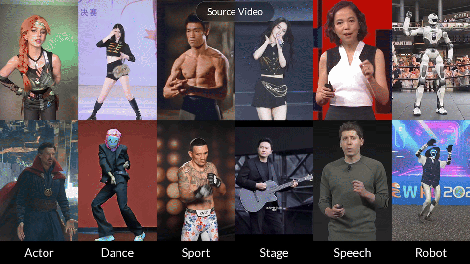
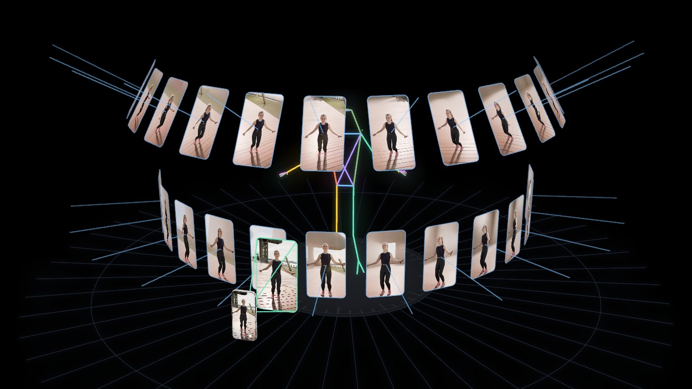
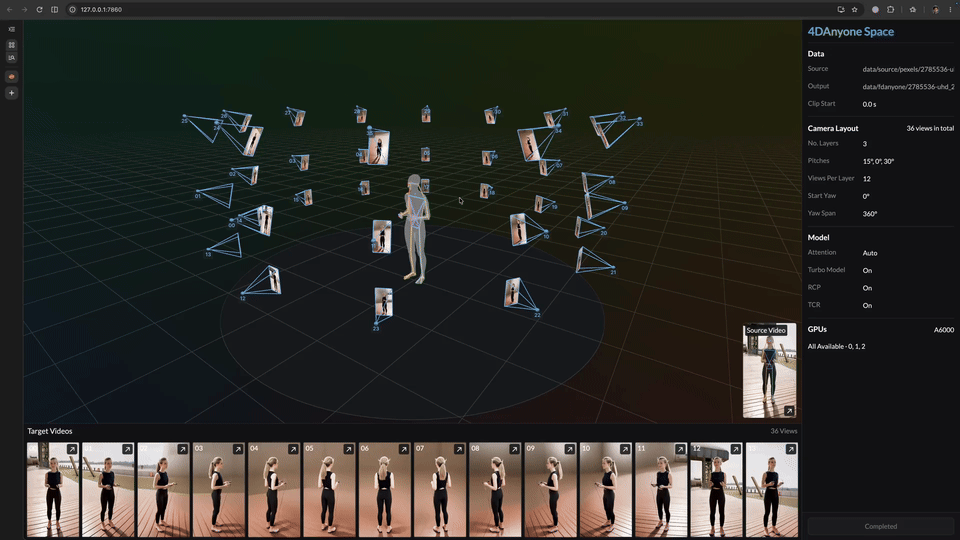

<p align="center"><a href="https://4danyone.github.io/"></a></p>

<h2 align="center">4DAnyone: Create Anyone in 4D from a Casual Monocular Video</h2>

<p align="center"><a href="https://4danyone.github.io/"><strong>Project Page</strong></a> &nbsp;|&nbsp; <a href="https://arxiv.org/abs/2608.20335"><strong>Paper</strong></a></p>

<p align="center"></p>

4DAnyone turns a casual monocular video into consistent multiview videos, enabling downstream 4DGS reconstruction.

- No input camera parameters or static camera required.
- Supports dozens of output views with flexible camera placement.

## News

> [!note]
> We're actively improving 4DAnyone. We recommend using the latest code.

- **2026-09-16**: Released a **GUI** for interactive inference and visualization.
- **2026-09-05**: Reduced peak GPU memory below **24 GB**, enabling inference on consumer GPUs (RTX 4090).
- **2026-09-02**: Released **4DAnyone-Turbo**, achieving a **5.58×** denoising speedup over 4DAnyone-Base.
- **2026-08-28**: Achieved a **1.42×** end-to-end speedup and reduced peak GPU memory below **32 GB**.

## Installation

```bash
git clone https://github.com/ant-research/4DAnyone.git
cd 4DAnyone
git submodule update --init third_party/GVHMR

conda create -n 4danyone python=3.11 -y
conda activate 4danyone
pip install -r requirements.txt
```

For faster inference, optionally install [FlashAttention-3](https://github.com/Dao-AILab/flash-attention/tree/main/hopper) or [SageAttention](https://github.com/thu-ml/SageAttention). The installed backend is enabled automatically.

Missing models and examples are downloaded automatically on first use. You can also download them manually:

```bash
python scripts/download_smplx.py
python scripts/download_model.py
python scripts/download_example.py
```

## Inference

We provide two models: **4DAnyone-Base** with the standard denoising schedule and the distilled **4DAnyone-Turbo** for faster four-step denoising (enabled by default).

> [!note]
> See [Inference performance](docs/inference_performance.md) for GPU memory, inference speed, and generation quality benchmarks.
>
> - Peaks at 22 GB of CUDA memory, enabling inference on consumer GPUs.
> - Averages 27 seconds per 121-frame video on a single RTX 4090.
> - 4DAnyone-Turbo delivers generation quality comparable to 4DAnyone-Base.

4DAnyone supports flexible target-view counts, pitch layers, and yaw coverage. Run `python inference.py --help` to see all available options. Here are several common camera configurations:

### 6-View Full Orbit

A compact 360° layout for basic coverage. Start here for an initial test.

```bash
python inference.py \
    --video_path "data/source/pexels/2785536-uhd_2160_3840_25fps.mp4" \
    --output_dir "data/fdanyone/pexels/2785536-uhd_2160_3840_25fps" \
    --views_per_layer 6
```

<p align="left"></p>

### 24-View Full Orbit

A dense 360° layout with broad angular coverage, suitable for 4DGS reconstruction.

```bash
python inference.py \
    --video_path "data/source/pexels/2785536-uhd_2160_3840_25fps.mp4" \
    --output_dir "data/fdanyone/pexels/2785536-uhd_2160_3840_25fps" \
    --views_per_layer 24
```

<p align="left"></p>

### 48-View Full Orbit, Three Pitch Layers

This layout distributes views across three pitch rings for broader coverage, enabling free-viewpoint 4DGS rendering.

```bash
python inference.py \
    --video_path "data/source/pexels/2785536-uhd_2160_3840_25fps.mp4" \
    --output_dir "data/fdanyone/pexels/2785536-uhd_2160_3840_25fps" \
    --views_per_layer 16 --layer_pitches '[-10,15,35]'
```

<p align="left"></p>

### 24-View Frontal Arc, Two Pitch Layers

A two-layer layout for dense coverage across the frontal 180° arc.

```bash
python inference.py \
    --video_path "data/source/pexels/2785536-uhd_2160_3840_25fps.mp4" \
    --output_dir "data/fdanyone/pexels/2785536-uhd_2160_3840_25fps" \
    --views_per_layer 12 --layer_pitches '[0,30]' --start_yaw -90 --yaw_span 180
```

<p align="left"></p>

### Output Structure

```bash
<clip>/                           # input filename without its extension
├── metadata.json                 # run settings, timings, resources
├── cameras.json                  # intrinsics and poses for N target views
├── gvhmr/                        # reusable motion recovery
│   ├── motion.json               # source timeline and motion metadata
│   └── motion.safetensors        # motion tensors
├── skeletons/00.mp4 ... <N-1>.mp4  # pose conditioning for each target view
└── videos/00.mp4 ... <N-1>.mp4     # target videos
```

### Custom Data

Use an input video with:

- a single person in a full-body or upper-body shot.
- no large camera movements, clear footage.
- 1080p or higher, 9:16 portrait aspect ratio, at least 121 frames.

## GUI

We provide a Gradio space for interactive inference and visualization. It is built with [Rerun](https://rerun.io/), inspired by the community [4DAnyone-Rerun Space](https://huggingface.co/spaces/rerun/4danyone-rerun).

<p align="center"></p>

Install the GUI packages in the `4danyone` environment:

```bash
pip install -r requirements-gui.txt
```

Pass an existing output directory to view inference results:

```bash
python app.py \
    --output_dir "data/fdanyone/pexels/2785536-uhd_2160_3840_25fps" \
    --server_port 7860
```

Choose a source video and a new output directory to run inference:

```bash
python app.py \
    --video_path "data/source/pexels/2785536-uhd_2160_3840_25fps.mp4" \
    --output_dir "data/fdanyone/pexels/2785536-uhd_2160_3840_25fps" \
    --server_port 7860
```

Open http://127.0.0.1:7860 in your browser. For a remote GPU server, first forward the port from your local computer:

```bash
ssh -N -L 7860:127.0.0.1:7860 user@gpu-host
```

https://github.com/user-attachments/assets/a51ec078-2970-4a37-9061-104211e1618d

## Reconstruction

For 3DGS reconstruction, see the [nerfstudio guide](docs/nerfstudio.md).

We will integrate an open-source 4DGS reconstruction method. Stay tuned!

## Citation

If you find 4DAnyone useful or interesting, please cite our work and consider giving the repository a star ⭐:

```bibtex
@article{jin2026fdanyone,
  title={4DAnyone: Create Anyone in 4D from a Casual Monocular Video},
  author={Jin, Yudong and Xie, Tao and Zhang, Qihang and Shen, Zehong and Xu, Zhen and Shen, Yujun and Bao, Hujun and Zhou, Xiaowei and Xu, Yinghao},
  journal={arXiv preprint arXiv:2608.20335},
  year={2026},
  url={https://arxiv.org/abs/2608.20335}
}
```
